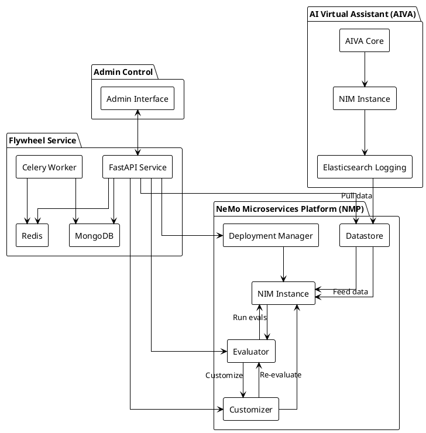
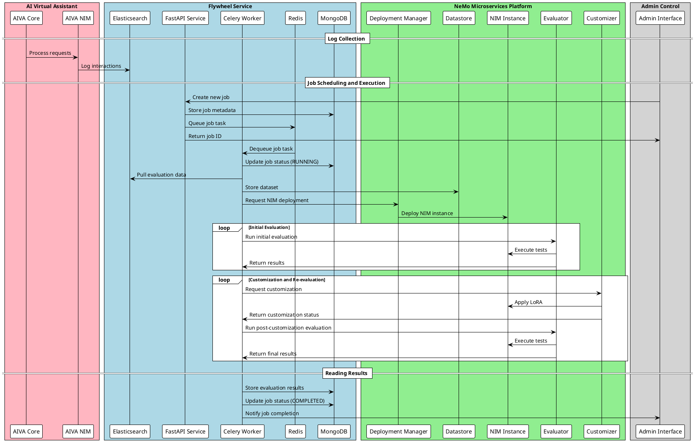

# Data Flywheel Blueprint Architecture

## Overview
The Data Flywheel Blueprint is a comprehensive system designed to automate and optimize the evaluation and fine-tuning of Large Language Models (LLMs) through a continuous feedback loop. This document outlines the core architectural components and their interactions.

## System Architecture Diagram



## System Interaction Flow



## Implementation Details

### Deployment
- NMP is deployed via Helm chart to an existing Kubernetes cluster
- AIVA and Flywheel Service are deployed separately from NMP
- Elasticsearch and MongoDB are managed services

### Development Focus
The Flywheel Service represents the primary development effort for this blueprint:
- All other components (NMP, AIVA, Elasticsearch, MongoDB) are existing services
- The Flywheel Service must be built from scratch
- Key components to implement:
  - FastAPI REST interface
  - Celery task management
  - Redis queue integration
  - MongoDB state management
  - NMP service integration

### Job Configuration
When scheduling a job, the following parameters are required:
```json
{
    "client_id": "string (required)",
    "workload_id": "string (required)",
    "webhook_uri": "string (optional)",
    "nim_list": ["string"] (optional)
}
```
- `client_id`: Unique identifier for the client organization
- `workload_id`: Identifier for the specific workload
- `webhook_uri`: Optional callback URL for job status updates
- `nim_list`: Optional list of specific NIMs to evaluate

### Elasticsearch Logging Schema
All interactions must be logged to Elasticsearch using the following Pydantic model:

```python
class ElasticsearchLogEntry(BaseModel):
    """Schema for logging interactions to Elasticsearch"""
    request: OpenAIChatRequest
    response: OpenAIChatResponse
    timestamp: float = Field(description="Unix timestamp with millisecond precision")
    client_id: str = Field(description="Unique identifier for the client organization")
    workload_id: str = Field(description="Identifier for the specific workload")
```

Key requirements:
- All fields are required
- `timestamp` must be a Unix timestamp with millisecond precision
- `client_id` and `workload_id` must match the job configuration
- The schema enforces type safety and validation

### Job Configuration Schema
Job scheduling is configured using the following Pydantic model:

```python
from typing import Optional, List
from pydantic import BaseModel, Field, HttpUrl

class JobConfiguration(BaseModel):
    """Configuration for scheduling a new evaluation job"""
    client_id: str = Field(
        description="Unique identifier for the client organization",
        min_length=1
    )
    workload_id: str = Field(
        description="Identifier for the specific workload",
        min_length=1
    )
    webhook_uri: Optional[HttpUrl] = Field(
        default=None,
        description="Optional callback URL for job status updates"
    )
    nim_list: Optional[List[str]] = Field(
        default=None,
        description="Optional list of specific NIMs to evaluate. If not provided, all supported NIMs will be evaluated."
    )

    class Config:
        json_schema_extra = {
            "example": {
                "client_id": "acme-corp",
                "workload_id": "chat-support-v1",
                "webhook_uri": "https://api.acme-corp.com/webhooks/job-status",
                "nim_list": ["nim-gpt-4", "nim-claude-2"]
            }
        }
```

Key features:
- Required fields are enforced
- `webhook_uri` is validated as a proper URL
- `nim_list` defaults to None (evaluate all NIMs)
- Includes example configuration
- Field descriptions for documentation
- Minimum length validation for IDs

## Key decisions to discuss

### Metadata Handling Strategy

A key architectural decision involves how to handle `client_id` and `workload_id` metadata in requests to NIMs. The challenge arises because:
- These fields should be passed via the `metadata` attribute of `OpenAIChatRequest`
- NIMs do not support the `metadata` field and will return 400 errors if it's included
- The fields are required for proper logging and workload tracking

#### Available Solutions

1. **NIM Modification**
   - Patch NIM to support metadata fields
   - Requires Arun to update all LLMs to a new base image
   - Pros: Cleanest solution
   - Cons: Not feasible in the short term

2. **Proxy-Based Solution**
   - Deploy a proxy service (see `proxy.py`) that:
     - Accepts requests with metadata
     - Removes metadata before forwarding to NIM
     - Handles logging to Elasticsearch
   - Pros:
     - No changes required to NIM or AIVA
     - Clean separation of concerns
     - Can be deployed independently
   - Cons:
     - Additional service to maintain
     - Slight latency overhead

3. **AIVA Workload Routing**
   - Modify AIVA to route specific workloads to specific NIMs
   - Use sidecar functionality to hardcode client_id and workload_id
   - Pros:
     - No additional services required
     - Direct integration with AIVA
   - Cons:
     - Less flexible
     - Requires AIVA modifications
     - Harder to maintain

4. **AIVA Logging**
   - Move logging responsibility to AIVA
   - AIVA handles metadata and logging directly
   - Pros:
     - No additional services
     - Direct control over logging
   - Cons:
     - Requires AIVA modifications
     - Less separation of concerns
     - May complicate AIVA's core functionality

### Recommended Approach

The proxy-based solution (Option 2) is recommended because:

- It provides the cleanest separation of concerns
- Requires no modifications to existing services
- Can be deployed and scaled independently
- Maintains flexibility for future changes
- Follows the principle of least surprise

The proxy service would:

1. Accept requests with metadata
2. Extract and store metadata for logging
3. Remove metadata before forwarding to NIM
4. Handle all Elasticsearch logging
5. Support both streaming and non-streaming responses

## Core Components

### 1. NeMo Microservices Platform (NMP)

- Overview of NMP's role in the system
- Key microservices:
  - Deployment Manager: Manages NIM instances
  - Evaluator: Runs evaluations against NIMs
  - Customizer: Creates LoRAs for supported NIMs
  - Datastore: Stores and manages datasets
- Integration points with other components

### 2. AI Virtual Assistant (AIVA)
- Overview of AIVA's role
- NIM management and configuration
- Elasticsearch logging integration
- Interaction with the Flywheel Service

### 3. Flywheel Service
- REST API implementation (FastAPI)
- Job scheduling and management (Celery)
- Data persistence:
  - Redis queue for workloads
  - MongoDB for application state
- Workflow components:
  - Dataset creation from Elasticsearch
  - NIM deployment and management
  - Evaluation pipeline
  - Customization process
- Supported NIM configurations (~20 NIMs)

### 4. Admin Control Component
- Job scheduling interface
- Results monitoring and analysis
- NIM configuration management
- AIVA modification controls

## System Workflow
1. Data Collection and Processing
2. NIM Evaluation Pipeline
3. Customization and Fine-tuning
4. Results Analysis and Decision Making
5. AIVA Integration

## Data Flow
- Elasticsearch to Datastore
- Datastore to NIM
- NIM to Evaluator
- Evaluator to Customizer
- Results to Admin Control

## Technical Stack
- FastAPI for REST API
- Celery for task scheduling
- Redis for queue management
- MongoDB for state persistence
- Elasticsearch for logging
- NMP microservices integration

## Security Considerations
- API authentication and authorization
- Data access controls
- Service-to-service communication security

## Scalability and Performance
- Horizontal scaling strategies
- Load balancing considerations
- Performance monitoring and optimization

## Future Considerations
- Additional NIM support
- Enhanced customization capabilities
- Extended evaluation metrics
- Integration with other AI platforms
